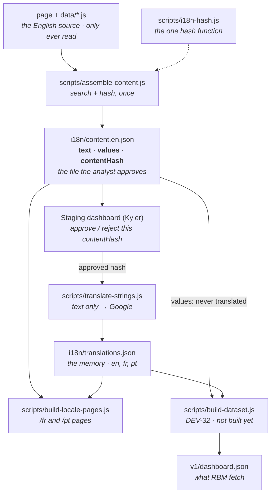

# DEV-31 — `content.en.json` and the translation pipeline

*Written by Jackson (Dev B), 28 September 2026. Values as of contentHash `3770b63cdea3…`. For Kyler (Dev A) and anyone who
maintains the data layer after handover.*

This is the current description of the translation pipeline. It replaces
`docs/TRANSLATION-PIPELINE.md`, which was removed on 27 September.

**If you build the staging dashboard, read §2 and §6. Everything else is background.**

---

## 1. What DEV-31 changed, in one paragraph

There is now one file, `i18n/content.en.json`, that holds **all the English content
of the dashboard** (every translatable string and every figure) together with a hash
of each part and one `contentHash` over the whole. It is written by one script,
`scripts/assemble-content.js`, and it is **the file the analyst approves**. Every
other script reads this file and never the source. `scripts/extract-strings.js`
and `i18n/strings.en.json` are gone: the extractor's search code moved, unchanged,
into `assemble-content.js`.

---

## 2. The data workflow



The order of a normal run, from the repo root:

```powershell
node scripts/assemble-content.js               # after ANY change to the page or data/*.js
node scripts/assemble-content.js --check       # optional: is the file current?
# analyst approves the new contentHash on the staging dashboard (CP-4)
node scripts/translate-strings.js --dry-run    # what would be sent, and the cost
node scripts/translate-strings.js --locale=fr
node scripts/translate-strings.js --locale=pt
node scripts/build-locale-pages.js             # writes dist/locale/{fr,pt} and self-checks
```

Since 30 Sep `translate-strings.js` also needs `APPROVED_CONTENT_HASH` set to the
approved `contentHash` (CP-4, §6); normally the approval job and the translate bot
run it, not a person — see [docs/translation-notes.md](../translation-notes.md).

`assemble-content.js` is silent when it succeeds. `translate-strings.js` and
`build-locale-pages.js` both **refuse to run** if `content.en.json` is out of date,
so a forgotten step 1 cannot produce a translation or a page from old content.

---

## 3. The files

| File | What it is | Edit by hand? |
|---|---|---|
| `scripts/i18n-hash.js` | The only code in the repo that hashes anything. A library: nothing runs it directly. | **No — frozen** (see §5) |
| `scripts/assemble-content.js` | Reads the page and `data/products.js`, `resistance.js`, `molecular-markers.js`; writes `i18n/content.en.json`. `--check` verifies it. | Yes, it is code |
| `i18n/content.en.json` | Generated. The approval unit. Committed, so an approval can point at a file and hash that exist in git. | **Never** |
| `scripts/translate-strings.js` | Sends the **text** section only to Google Cloud Translation v2 and fills empty locales in the memory. | Yes, it is code |
| `i18n/translations.json` | The translation memory, 404 entries. **Cannot be regenerated identically** — a rerun gives different French. | Only `fr` / `pt` values (see §4, rule 4) |
| `scripts/build-locale-pages.js` | Writes `dist/locale/fr/` and `dist/locale/pt/` by substitution, then self-checks. | Yes, it is code |
| `scripts/i18n-identifiers.js` | Derives the 35 protected identifiers (drug, marker, species names) from the data. | Yes, it is code |
| `dist/` | Generated, gitignored. Delete it and rebuild at will. | Never |

---

## 4. The translation pipeline and its rules

**Rule 1 — build-time substitution, never mutation.** The source page and the data
files are only ever read. French and Portuguese are produced as *copies* under
`dist/locale/`. Deleting that directory undoes the whole feature.

**Rule 1b — identifiers are not labels.** *This is the rule that cost two days.* A
string that is compared, indexed or looked up is an identifier however much it reads
like prose. Drug, marker and species names are pivot keys, `dict` entries and page
constants at once, and all three must agree:

```js
codeOf(field, value) => DS().dict[field].indexOf(value)   // -1 against a translated key
```

Translate one side and every study row is silently skipped: the page renders, logs
nothing, and the threat map is empty. `scripts/i18n-identifiers.js` derives the
protected set from the data (35 today), so a drug WHO adds next quarter is protected
the day it lands. They are never put in `content.en.json`'s text, never sent, never
substituted. `build-locale-pages.js` ends with a self-check that fails the build if
any locale draws different rows from English.

**Rule 2 — content-addressed memory.** Each memory entry is keyed by `key(English)`.
Edit the English and its key changes, so the lookup misses and the new text is
translated by itself. There is no staleness to manage.

**Rule 3 — the memory is the allow-list.** A string is substituted only if it is in the
approved text section of `content.en.json` **and** has a translation in the memory.
Pattern discovery that over-reaches is harmless: an unwanted string never gets a
translation, so it is never substituted.

**Rule 4 — empty locale only.** A locale slot that already holds text is never
overwritten by any later run. That is what makes hand corrections to `fr` / `pt` in
`translations.json` survive. (`en` in each entry is a copy; do not edit it — §5.)

**Placeholder protection.** `${...}` holes and protected terms (LAUNCH, Unitaid, ACT,
PQ, …) are masked as `⟦n⟧` before sending. If a token does not come back, the
translation is **rejected** and the English kept. Three strings (the `PQ'd` / `MFT`
ones) are rejected this way today; that is expected, and why a dry run always shows
`3 to translate`.

**The deny-list.** Provenance never goes to an engine: `source`, `citation`, dates,
URLs, species binomials, gene markers. This is a §8 contract requirement. DEV-31 adds
a structural guarantee on top: `translate-strings.js` reads only the `text` section,
so nothing in `values` can reach Google even by mistake.

**Price guard.** A product price note is only included, translated or published when
`price.confirmedInWriting === true`.

Current output: **97% coverage** both locales (525 fr / 530 pt substitutions, 14 left
in English each). Known wrong-sense translations (e.g. *Pipeline* → *Gasoduto*) are
listed in `DEV-B-PLAN.md` §11 and are faults of one-word English, not of the engine.

---

## 5. How the hashing works

`scripts/i18n-hash.js` has two functions, and nothing else in the repo may call
`crypto.createHash`:

| Function | Input → output | Used for |
|---|---|---|
| `key(text)` | collapse whitespace, trim, sha256, first 16 hex. `"Pipeline"` → `37e1c775f452d695` | the key of every memory entry and every `text` entry |
| `digest(value)` | canonical JSON (object keys sorted at every level, CRLF read as LF), then full sha256 | each data file's `sha256`, and `contentHash` |

The same input gives the same hash on Windows and on Linux (GitHub Actions), in any
key order. **Treat the file as frozen**: change either rule, even how spaces are
trimmed, and every one of the 404 memory keys changes at once — all lookups miss,
everything is re-translated and billed, and hand corrections become unreachable.
`assemble-content.js --check` fails if any memory key stops matching the rule.

Hashing happens **once**, in `assemble-content.js`. The other scripts read the saved
keys from `content.en.json`. The only script that re-hashes is `--check` (and the same
check run at the start of `translate-strings.js` and `build-locale-pages.js`), on
purpose, to prove the saved hashes still describe the source.

---

## 6. `content.en.json` — the shape (for the staging dashboard)

There is no separate spec: **this shape is the contract** between `assemble-content.js`
and the staging dashboard. Schema id `launch-content/1`. About 590 KB.

```jsonc
{
  "schema": "launch-content/1",
  "note": "Generated by scripts/assemble-content.js. Do not edit by hand: ...",
  "contentHash": "3770b63cdea3b7eb66dd7648b471134df72546f5ccbf29fc03e839a887add3ed",
  "counts": { "data": 228, "markup": 80, "js": 115, "total": 423 },

  "text": [
    { "key": "fb293d4b4d34a477", "bucket": "data",   "en": "R&D & clinical", "where": "products.stages[0]" },
    { "key": "a4023b89022f326c", "bucket": "markup", "en": "Download CSV",   "where": "static text" },
    { "key": "c1f88e9d6c4145cf", "bucket": "js",     "en": "In progress",    "where": "line 1292", "quote": "\"" }
  ],

  "values": {
    "data/products.js":          { "sha256": "83858aea…40d9dc", "data": { /* the parsed file, verbatim */ } },
    "data/resistance.js":        { "sha256": "a4ac94f0…4e31ba", "data": { … } },
    "data/molecular-markers.js": { "sha256": "a0fd0b0d…9210d4", "data": { … } }
  }
}
```

| Field | Meaning |
|---|---|
| `contentHash` | sha256 over `schema` + every text entry's `{key, bucket, en}` + each values file's `sha256`. **This is what an approval approves.** |
| `text[].key` | `key(en)` — the lookup key into `translations.json` |
| `text[].bucket` | `data` (a field in `data/*.js`), `markup` (static HTML), `js` (a literal in the page's script) |
| `text[].en` | the English, already trimmed |
| `text[].where` | where it was found: a field path for `data`, a line number for `js`. **Not hashed** — moving a string to another line does not void an approval |
| `text[].quote` | `js` literals only: the quote character. Not hashed |
| `values[file].data` | the whole parsed data file — figures, study rows, sources, citations, URLs |
| `values[file].sha256` | `digest(data)` |

Notes: the same English can appear twice in `text` with different buckets (same `key`
both times). Entries are in discovery order, which is deterministic. Unchanged
content produces a byte-identical file, so a commit of it only shows a diff when
something really changed.

### What the staging dashboard needs to do

1. **Show the content**: `values` for the figures and their sources, `text` for the
   strings. Each figure and each new string is checked against the public source it
   came from — the sources and citations are inside `values[file].data`.
2. **Show only what changed** since the last approved version. Compare against the
   last approved `content.en.json` (by its `contentHash`):
   - text: by `bucket` + `key` — a new key is new or edited English;
   - values: first by `values[file].sha256`; only if a file's hash differs, diff inside
     its `data`. (Per-record hashes were considered and not added; the diff within a
     changed file is the dashboard's job.)
3. **Approve or Reject the whole file**, recording the **full 64-character
   `contentHash`** — not a file name, not a date. No editing on the dashboard.
   Reject publishes nothing, in any language.
4. **Do not compute hashes in the browser.** Display `contentHash` from the file. If the
   dashboard ever must verify one, it has to implement `digest()` exactly as in
   `scripts/i18n-hash.js` — two implementations that disagree by one whitespace rule
   fail silently. Prefer running `node scripts/assemble-content.js --check` in CI.
5. **Never send anything to a translation engine.** Approval is on English only
   (`/en`). Translation happens after, in `translate-strings.js`.

### Still open

- **CP-4: where the approval record lives** (a file in the repo, a git tag, or a merged
  PR). `translate-strings.js` has a marked `approvalGate()` stub that currently only
  prints the hash; once the location is agreed it must exit unless `contentHash` is
  approved. `build-dataset.js` (DEV-32) will ask the same question.
  **Resolved 30 Sep** (`translation-workflow`): the approval is the `approved`
  label on a proposal, recorded with its `contentHash` in `data/decisions.js`;
  `approvalGate()` now exits unless `APPROVED_CONTENT_HASH` equals the content's
  `contentHash`. See [docs/translation-notes.md](../translation-notes.md).
- **Portuguese locale code.** We emit `pt-PT`. If RBM's site expects `pt-BR`, their page
  reads a key that is not there. To be confirmed with RBM.

---

## 7. When the data changes

1. A data file or the page changes (a scheduled fetch, or a hand edit).
2. Any script that reads `content.en.json` stops:
   ```
   i18n/content.en.json is OUT OF DATE or invalid:
     data/products.js changed
     text: 1 string(s) added or changed, 0 removed or changed
   run: node scripts/assemble-content.js
   ```
3. Run `node scripts/assemble-content.js`. `contentHash` changes, so the old approval no
   longer matches — any edit needs a fresh approval, which is the point.
4. Commit `i18n/content.en.json`; the analyst approves the new hash.
5. `translate-strings.js` sends only the new or edited strings. Unchanged strings keep
   their keys and are already in the memory.
6. Build the pages.

`--check` also catches: `content.en.json` edited by hand; a `translations.json` key that
no longer matches its `en` (the integrity check parked in `DEV-B-PLAN.md` §9, now on).

---

## 8. Security — not negotiable

- `GOOGLE_API_KEY` (and `DEEPL_API_KEY`) come from the environment only. Never committed,
  never in a file, never in a browser bundle. Set it per PowerShell window:
  `$env:GOOGLE_API_KEY = "…"`.
- The Google key travels in the URL query string: restrict it to the Cloud Translation API
  in the Google console and set a budget alert. Google bills past the 500,000
  characters/month allowance rather than stopping.
- Nothing confidential, personal or pre-approval may enter the public data repository.
- Source credentials are organisation secrets, never personal accounts.

---

## 9. How DEV-31 was verified (28 September 2026)

| Check | Result |
|---|---|
| `content.en.json` text vs the previous `strings.en.json` | 423 = 423 strings, same text, bucket, location and order |
| Rebuilt `dist/locale/fr` and `pt` vs the pages before DEV-31 | **byte-identical**, after each step |
| Coverage | 525 fr / 530 pt, 97%, unchanged |
| `build-locale-pages.js` self-check | all checks passed |
| `translate-strings.js --dry-run` | 416 in memory, 3 to translate (the 3 known rejects), unchanged |
| Two runs of `assemble-content.js` | byte-identical file, same `contentHash` |
| Change one string in a copy | exactly 1 entry added, `contentHash` and `products.js` hash change, the other two do not |
| Change one number in `resistance.js` in a copy | `--check` reports `data/resistance.js changed` |
| Hand-edit `content.en.json` in a copy | `--check` reports it |
| Convert the data files to Windows line endings in a copy | same `contentHash` |
| Hand-edit an `en` in `translations.json` in a copy | `--check` reports the key mismatch |
| `createHash` anywhere outside `i18n-hash.js` | none |
| Memory keys matching `key(en)` | 404 / 404 |
| Stale file | `translate-strings.js` and `build-locale-pages.js` both exit 1 |
