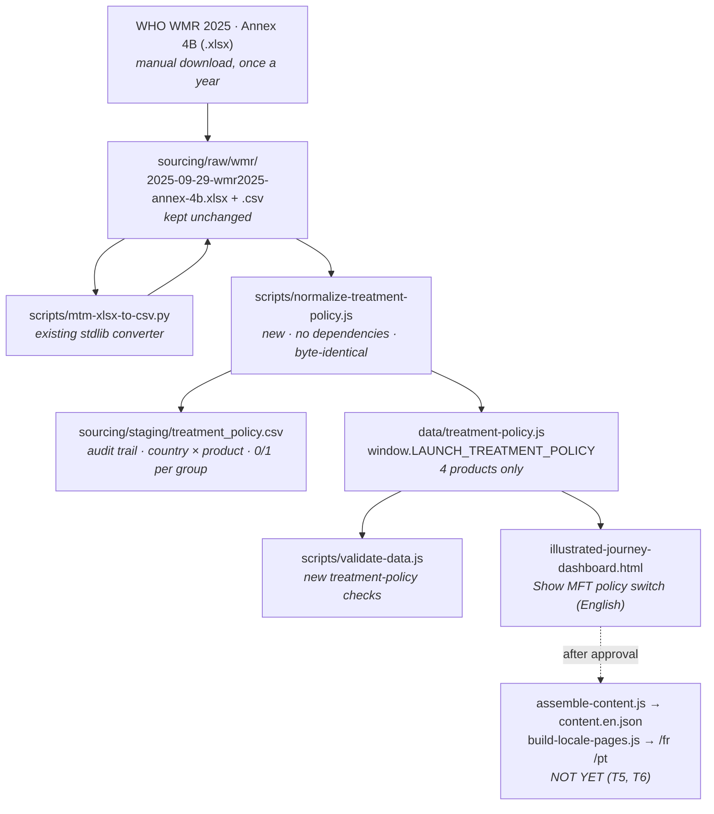

# MFT policy on the Country access map (feat/mft-policy-map)

*Written by Jackson (Dev B), 30 September 2026. Branch `feat/mft-policy-map`, cut from
`origin/development`, to be merged back into `development`. Source extract:
WHO World Malaria Report 2025, Annex 4B, data as of 29 September 2025.*

**Status:** the English build is done and verified: data, validator, page and docs.
French and Portuguese pages are **not** done yet. They wait until the design is approved
(see §9). If you only read one section, read §9.

---

## 1. What this adds, in one paragraph

The Country access map has a new **"MFT policy"** section in its left rail. It holds one
switch, **Show MFT policy**, which is **off by default**. With the switch off, the page
looks and behaves exactly as it did before. With the switch on, the map draws a border
around every country whose **national treatment policy** lists the selected medicine,
in that medicine's own colour:

- **solid** means the medicine is first-line for tested *P. falciparum*;
- **dashed** means it is listed only for a smaller patient group.

The access-stage fill underneath is unchanged. The switch adds three more things:

- The legend gains a row of patient-group chips that hide or show each group on the map.
- With no country selected, the Detail panel shows a donut chart and a list of the
  countries grouped by patient group, with each country's access stage.
- With a country selected, the Detail panel shows its access stage, then its policy
  card, then its study list if a study result is on.

The data comes from WHO's own table of national drug policies. Only the four dashboard
medicines are ever read, stored or named.

## 2. How to read it (plain version)

| On the map | Meaning |
| --- | --- |
| Fill colour | Access stage: registered, in national guidelines, or in MFT plans. **Unchanged.** Still illustrative for most countries. |
| Solid border, drug colour | The country's national policy lists this medicine as a **first-line** treatment for **tested** (confirmed) *P. falciparum* malaria. |
| Dashed border, drug colour | The policy lists it **only** for a smaller group: untested *P. falciparum*, *P. vivax*, or severe malaria or pregnancy. |
| No border | This medicine is not in that country's policy, or WHO has no row for the country. |

**Tested and untested.** In WHO's table, "tested" means malaria was confirmed by a test
(microscopy or RDT) before treatment. "Untested" means it was treated on symptoms alone.
First-line for tested patients is the main policy line. The other columns are narrower uses.

**Policy is not use.** A listed medicine can still be out of stock. A country can also use a
medicine its policy does not list. The page says this under the legend and in every panel.

## 3. Data flow



## 4. Decisions, with what was rejected and why

The design went through several rounds of mock-ups (all in `Claude outputs/`:
`mft-policy-map-options.html`, `mft-policy-option-d.html`). What was decided, in order:

1. **Do not depend on the study layers.** Treatment failure, delayed clearance and
   molecular markers may be removed from the dashboard, so the MFT view had to work on
   the access map alone. That ruled out designs that put MFT inside the study panel.
2. **Only the four dashboard medicines.** The annex lists many other drugs (AL, AS+AQ,
   AS+MQ, primaquine and others). An early mock-up showed them. That was removed because
   the page must not name drugs it does not track. As a result, "how diversified is a
   country" can only be answered for these four medicines, not across the whole policy.
3. **One medicine at a time**, following the existing Drug tabs. A per-drug view was
   chosen over a combined "any of the four" view. The drug buttons show no counts
   (an earlier draft showed "ASPY 6 · DHA–PPQ 9" on them).
4. **Rejected: a third "Map layer" choice** (Access stage / MFT policy / Both). It was
   picked at first and then dropped: the reader had to choose a layer before seeing
   anything, and the MFT layer could not be shown together with a study result.
5. **Rejected: MFT dots on top of the access fill.** They collide with the study dots,
   which already use circles.
6. **Rejected: recolouring the fill by policy.** That hides the access stage, which is
   the map's main purpose.
7. **Chosen: option D.** Borders over the unchanged fill, plus the Detail panel (donut
   and grouped list, or a country card above the studies). Borders use a different
   visual channel from both the fill and the dots, so all three can be shown together.
8. **Behind a switch, off by default.** With the switch off, the page is exactly the old
   page. Every MFT element hides when the switch is off, including the Detail panel.
   The switch has its own rail section rather than being a radio choice among layers.
9. **Solid vs dashed = first-line vs smaller patient group.** Each country is counted
   in one group only, by this precedence:
   tested → untested → *P. vivax* → severe/pregnancy.
   That way the donut, the chips and the list always add up to the same total.
10. **Empty state for GanLum and ALAQ.** Neither appears in any national policy yet
    (0 countries). They show a plain sentence instead of an empty map with no explanation.
11. **French Guiana.** It lists DHA–PPQ (first-line, tested) but has no shape of its own
    on the basemap; it is drawn as part of France. It is **not counted** in the map
    totals, which cover only the 94 drawn countries, the same set the access legend
    counts. In the all-regions view the panel names it in a note instead. This is why
    DHA–PPQ is **12 in the annex** but **11 on the map** (10 first-line vs 9).
12. **Transparency Platform template** (the xlsx shared on 29 Sep). It has 0 country rows,
    so there was no data to load. Its rules were used instead:
    - one record per country × product;
    - source, source date and last-verified date on every record;
    - no yes/no "MFT in place" label.

    Its *Approach type* and *MFT considered?* fields could be added once partners fill
    them in.
13. **The stage data stays as it is.** The access-stage fill is still illustrative for
    most countries (see `data/products.js`, `detail.countries.status`). This branch does
    not change it.

## 5. Data rules (scripts/normalize-treatment-policy.js)

- **Input:** the CSV export of the annex's "Annex B" sheet (149 rows × 41 columns).
  **Output:** 81 policy rows covering 80 countries and areas. The raw `.xlsx` is kept
  unchanged (md5 `8ae05422862c291489e0a11a0a6bf713`).
- **Product matching.** Each product is matched by a regex over each policy cell:

  | Product | Matches |
  | --- | --- |
  | ASPY | `AS-PY`, `PY-AS`, and a bare `PY` (Republic of Korea) |
  | DHA–PPQ | `DHA-PPQ`, with or without PQ |
  | ALAQ | `AL-AQ`, `ALAQ`, `AL+AS+AQ` |
  | GanLum | `GAN`, `KAF156`, `GANAPLACIDE` |

  No other drug is written out.
- **Patient groups** are the annex columns:
  - tested = *uncomplicated confirmed* P. falciparum;
  - untested = *uncomplicated unconfirmed* P. falciparum;
  - severe = *severe* malaria;
  - pregnancy = *prevention during pregnancy*;
  - vivax = *P. vivax treatment*.
- **Every annex country is written**, including those that list none of the four products.
  This keeps "not in policy" separate from "not in the WHO table".
- **Special cases:**
  - Tanzania: the mainland row goes to `TZA.products`, and the Zanzibar row goes to
    `TZA.parts.Zanzibar`. The card says what Zanzibar lists.
  - Footnote digits on names (South Sudan, Indonesia) are stripped.
  - Legend and footnote rows (nothing in the policy columns) are skipped.
  - "Data as of" is searched for in every cell, and the header layout is checked.
  - An unknown country name stops the script (exit 1). It never guesses.
  - Notes on Korea `PY`, Ecuador `AL+AM+PQ`, Tanzania/Zanzibar and French Guiana are
    kept in `meta.notes`.
- **Deterministic:** no clock reads. `LAST_VERIFIED` is set by hand, so a rerun is
  byte-identical.
- **Meta** carries source, source URL, extract, edition, policy year (2024), data-as-of
  date, last verified date, licence (CC BY-NC-SA 3.0 IGO), status `draft`, and the plain
  rule "policy lists, not use".

## 6. Page implementation (illustrated-journey-dashboard.html)

All changes are additions, about +340 lines. Nothing existing was removed.

| Where | What |
| --- | --- |
| `<script>` tags | `data/treatment-policy.js` loaded after `molecular-markers.js`. |
| CSS | New `--mft-*` drug colour tokens and `.mft-*` rules, inserted before `.mapwrap`. Colours: GanLum `#D4557A`, ALAQ `#8C6A3F`, ASPY `#E08A1E`, DHA–PPQ `#2E9B5F`. |
| Left rail | `#mft-controls` section with `#mft-switch` (`role="switch"`, `aria-checked`) and a one-line hint. It stays hidden if the data file is missing. |
| Legend bar | `#mft-legend` (chips with counts, `aria-pressed`) and `#mft-rule` (the reading rule). |
| Detail panel | `#mft-panel`, placed above the study note and the study list. When the study list is open, it is capped at 50% of the height so the studies stay visible. |
| Map style | Three line layers after `country-line`: `mft-halo` (white, 4.2), `mft-solid` (2.6) and `mft-dash` (2.4, dasharray 2/1.4). They start hidden with empty filters. |
| State | `TP`, `mftOn`, `mftSel`, `mftPanelIso`, `mftProductId`, `mftByIso`, `mftHide`, declared right after `readMapColors()`. |
| JS block | `mftCat`, `mftScope`, `mftPaint`, `mftCounts`, `mftLegend`, `mftDonut`, `mftPanel`, `mftRender`, `mftFollowPanel`, `mftTipLine`, plus the switch and canvas handlers. Inserted just before `map.on("load")`. |
| Hooks | `selectMap` (sets the product and stage lookup before `bindDrug`, then renders), `openMarkPanel` (the card follows the clicked study dot), `closePanel`, `applyLocationFilter` (counts and borders respect the Region/Country filter) and `countryTip` (adds an MFT line to the keyboard country list tooltip). |

Behaviour notes:

- Hover and click on countries are active **only while the switch is on**, and only when
  the event comes from the canvas itself. Study dots are DOM markers above the canvas
  and keep their own tooltip and click.
- Counts and borders cover the 94 drawn countries (`LAUNCH_MAP.countries`) within the
  Location filter. They match the access legend's own basis.
- Chips hide a group's borders on the map. The totals in the donut and the list do not
  change, so the chip counts stay readable.
- Choosing a country in Location → Country opens that country's card directly.
- **Detail panel style (revised 30 Sep, from Jackson's mock-up).** The list view has:
  - a header with a drug-colour dot ("MFT POLICY · ASPY");
  - a donut with the total in its centre;
  - a key with square swatches that always lists all four groups, including zeros:
    *Tested P. falciparum*, *Untested only*, *P. vivax only*, *Severe only*
    (the last one covers pregnancy-only listings too);
  - group headings with counts ("TESTED P. FALCIPARUM · 6");
  - one row per country: its name, its access stage in grey ("No data" included), and a
    dot on the right in its group's shade.

  Country names are WHO's own names from the annex (e.g. *Democratic Republic of the
  Congo*, *Viet Nam*, *United Republic of Tanzania (mainland)*). Long names wrap onto a
  second line instead of being cut off. The country card uses the same header, then an
  *Access stage* / *Policy group* pair and the "Listed for" chips. The WHO source line
  stays at the bottom of both views for the licence credit. The legend chips under the
  map keep their longer labels.
- Nothing was changed in: `data/products.js`, the resistance and marker data and
  normalizers, Streamlit, Power BI, the ontology, or the Unitaid edition.

## 7. Numbers in this extract

Counts are "first-line (tested)" / "any group".

| Product | Annex | Drawn on map | Countries |
| --- | --- | --- | --- |
| GanLum | 0 / 0 | 0 / 0 | none, so the empty message shows |
| ALAQ | 0 / 0 | 0 / 0 | none, so the empty message shows |
| ASPY | 6 / 8 | 6 / 8 | first-line: Burkina Faso, Cameroon, DR Congo, Nigeria, Rep. of Korea, Thailand. Untested only: Viet Nam. *P. vivax* only: South Sudan. |
| DHA–PPQ | 10 / 12 | 9 / 11 | first-line: Angola, Burkina Faso, Cameroon, Gabon, Indonesia, Nigeria, Tanzania (mainland), Thailand, Viet Nam, plus French Guiana (not drawn). Untested only: Ghana. Severe/pregnancy only: Papua New Guinea. |

## 8. Verification (30 Sep 2026, on the branch)

| Check | Result |
| --- | --- |
| `normalize-resistance.js`, `normalize-molecular-markers.js` | byte-identical (md5 of the data and staging files unchanged) |
| `normalize-treatment-policy.js` rerun | byte-identical |
| `validate-data.js` | **0 errors, 6 warnings** (3 resistance + 2 molecular markers + 1 treatment policy, which is GUF). `CLAUDE.md` is updated to match. |
| `validate-data.js data/products.synthetic.js` | 0 errors, 0 warnings |
| Validator negative test | A corrupted `treatment-policy.js` produced the expected errors; the file was then regenerated. |
| `make-preview.js` | wrote `preview.html` |
| Inline scripts `node --check` | all 3 OK |
| Headless Chromium (swiftshader flags) | Switch off: identical to before, with no MFT elements. ASPY and DHA–PPQ on: borders, chips, donut and grouped list. Chip hide works. Country card works, including the Tanzania/Zanzibar note. The card sits above the study list when a dot is clicked. The AFRO filter narrows counts (DHA–PPQ 7). GanLum and ALAQ show the empty message. Switching off again hides everything. **0 console errors.** |
| NUL bytes | 0 in every changed or new file |
| Line endings | unchanged per file |

## 9. What still needs doing

In order. Items 1–3 are the translation work that waits for approval.

1. **T5 — `scripts/assemble-content.js`.** It hard-codes three data files. Add
   `data/treatment-policy.js` and register the new English strings (the switch label
   and hint, legend chips, rule text, panel headings, empty message, source line). Then
   rerun it so `i18n/content.en.json` and its `contentHash` include them. Until then,
   `content.en.json` is stale for this feature. No CI job runs the script, so nothing
   breaks in the meantime.
2. **T6 — `scripts/build-locale-pages.js`.** It also hard-codes three data files. Add the
   new script tag and translate the MFT strings, which are built in JS template strings,
   so they need the same treatment as the existing study-panel strings.
3. **Translations:** run `translate-strings.js` for fr and pt, review
   `i18n/translations.json`, rebuild `/fr` and `/pt`, and screenshot them.
4. **T7 — Unitaid edition.** Rebuild with `node scripts/build-unitaid-theme.js` if the
   Unitaid copy should get the switch. It has not been requested yet.
5. **Stage data.** The access-stage fill is still illustrative. Border and fill will only
   be comparable once the country survey is verified.
6. **DEV-32 `build-dataset.js`.** When it is built, include
   `LAUNCH_TREATMENT_POLICY` in `v1/dashboard.json`, with the licence and `meta.rule`.
7. **Yearly refresh.** Follow the manual step in `sourcing/README.md` when WHO publishes
   WMR 2026 (usually December). Then check the validator counts and update §7 here.
8. **User guide.** Add a short "Show MFT policy" paragraph to `docs/user-guide.md` once
   the design is approved, and add the new script to the repo map in
   `docs/developer-guide.md`.
9. **Later, optional:** the Transparency Platform fields *Approach type* and *MFT
   considered?*, once partners fill them in.

## 10. Files in this change

New:

- `sourcing/raw/wmr/2025-09-29-wmr2025-annex-4b.xlsx` (WHO original, unchanged)
- `sourcing/raw/wmr/2025-09-29-wmr2025-annex-4b.csv`
- `scripts/normalize-treatment-policy.js`
- `sourcing/staging/treatment_policy.csv` (generated)
- `data/treatment-policy.js` (generated)
- `docs/jackson/MFT-policy-map.md` (this file)

Changed:

- `illustrated-journey-dashboard.html`: the switch, layers, legend, panel and hooks
- `scripts/validate-data.js`: treatment-policy checks
- `CLAUDE.md`: verify block (new normalizer line, 6 warnings, new split)
- `sourcing/README.md`: script row and the annex manual step

Suggested commit (run by Jackson):

```
git add sourcing/raw/wmr sourcing/staging/treatment_policy.csv data/treatment-policy.js \
  scripts/normalize-treatment-policy.js scripts/validate-data.js \
  illustrated-journey-dashboard.html CLAUDE.md sourcing/README.md docs/jackson/MFT-policy-map.md
git commit -m "Add Show MFT policy switch to the Country access map (WHO WMR 2025 Annex 4B, English)"
git push -u origin feat/mft-policy-map
```

Then open a pull request into `development`.
