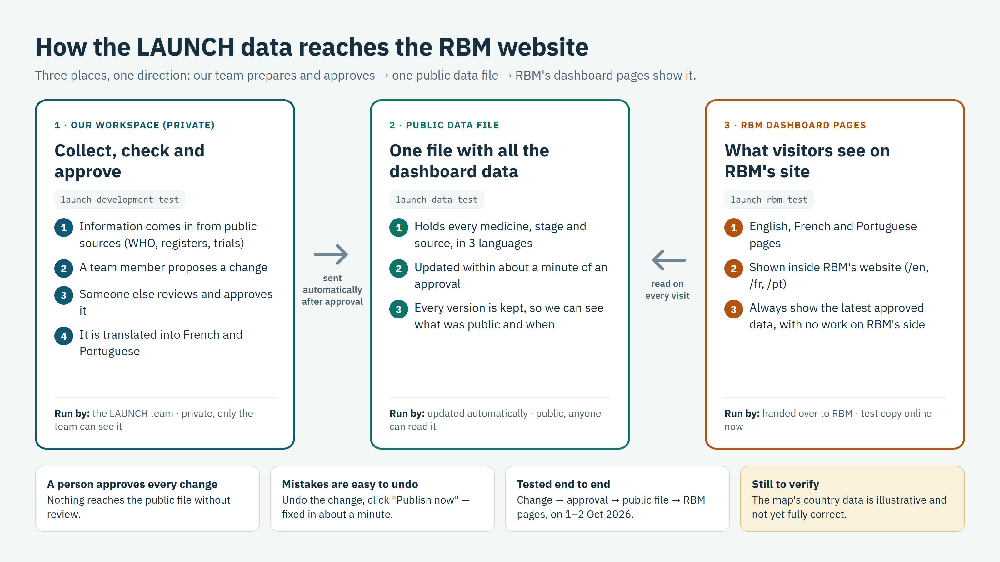

# Demo — data change to the RBM pages, end to end

*For the team demo, 3 Oct 2026. About 15 minutes. Details:
[RBM-public-data-layer.md](RBM-public-data-layer.md).*

## Before the demo (5 minutes)

- Open these tabs:
  1. https://codebyjackson.github.io/launch-rbm-test/ (the RBM test pages)
  2. https://codebyjackson.github.io/launch-data-test/v1/dashboard.json (the public file)
  3. https://github.com/KylerXiv/launch-development-test/actions (the pipeline)
  4. https://github.com/codebyjackson/launch-data-test/commits/main (publish history)
- Check `main` holds no test proposal (GanLum's WHO PQ listing step is *not
  done* on the RBM page). If one is left over, revert it first.
- Say up front: **the map's country data is illustrative and not yet correct**;
  today is about the workflow.

## 1. The picture (2 min)

Show the PNG above. Three places, one direction: the team prepares and
approves → one public file → RBM's pages show it. A person approves every
change; RBM never redeploys for a data update.

## 2. The RBM pages (3 min)

Tab 1 → **English**: four medicines, journeys, barriers; the map (click a
medicine, pick a region, turn on *Show MFT policy*). Then **Français** and
**Português**: same page, translated. Then **iframe test**: how RBM embeds it.
Point at GanLum's 4th step (WHO PQ listing): *not done*.

## 3. Make a data change (5 min)

1. Tab 3 → **Propose changes from public sources** → Run workflow → choose
   `test-data/regulatory/who-pq-ganlum-listed.csv`. (A test file that pretends
   WHO prequalified GanLum.)
2. Show the issue and PR it creates: the change is checked against the rules
   and previewed; nothing is public yet.
3. Add the label **`approved`** (the approver is recorded).
4. Back in Actions, watch four runs start one after another by themselves:
   Proposal decision → Snapshot history → Translate new text → **Publish to RBM
   data repo**. Open the last one: the summary lists exactly what changes.

## 4. See it arrive (2 min)

1. Tab 4: a new commit "Published after proposal #n, approved by @…".
2. Tab 2: refresh (add `?v=2` to the URL) → search `TEST-0001`.
3. Tab 1: refresh English, French, Portuguese → GanLum's WHO PQ step is now
   *done*. Nobody touched the RBM pages.

## 5. Undo (2 min)

1. Revert the change on `main` (GitHub: the merged proposal PR → **Revert** →
   merge; for a test proposal also remove the history snapshot it wrote — see
   RBM-public-data-layer.md §13).
2. Actions → **Publish to RBM data repo** → reason `Revert test proposal #n` →
   Run.
3. About a minute later the RBM pages show GanLum *not done* again; the public
   repo keeps both versions (`v1/archive/`).

## Questions to expect

- *Can a change reach RBM without review?* No: only an approval publishes by
  itself; anything else needs someone to click Publish now, with a reason.
- *What if the file is broken or missing?* The pages say "the data could not be
  loaded" instead of drawing half a dashboard; the build refuses to publish a
  file that fails its schema or tests.
- *What does RBM have to do for an update?* Nothing.
- *Is the map data right?* Not yet; the country lists are illustrative. Next.
