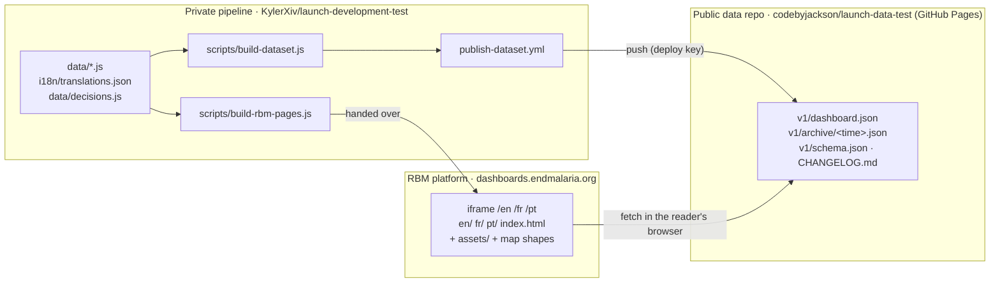
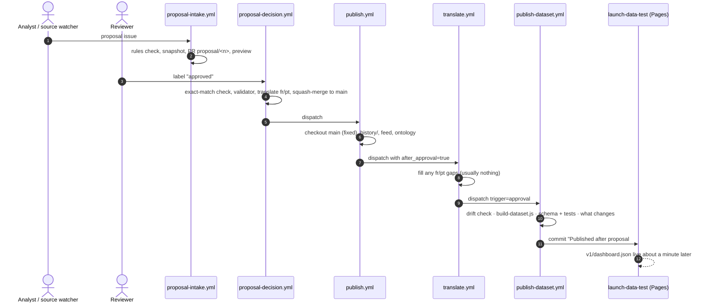

# RBM public data layer — what was built, how it works, how to test it

*Jackson (Oakkar-Min), with Claude Code, 1–2 Oct 2026. Covers the work for the
RBM handover (DEV-32). Everything below is merged into `main` and has been run
end to end on GitHub (section 12).*

| PR | What | State |
| --- | --- | --- |
| #32 `feat/public-data-layer` (includes `feat/remove-resistance-layers`) | `dashboard.json`, the public data repo, the publish workflow, the `publish.yml` fix; treatment failure, delayed clearance and molecular markers taken off the map | ✅ merged |
| #34 `feat/rbm-handover` | translation gaps fixed; the RBM pages | ✅ merged |
| #37 `fix/dataset-diff-lists` | the publish summary reports added/removed list entries, not shifts | ✅ merged |
| `docs/live-links` | live links; "about a minute"; this update | PR |

**The three repositories**

| Repo | Role | Live |
| --- | --- | --- |
| `KylerXiv/launch-development-test` (private) | the pipeline: data, review, approval, translation, workflows | LAUNCH site: launch-development-test.vercel.app |
| `codebyjackson/launch-data-test` (public) | the one published file, every earlier version, the contract | https://codebyjackson.github.io/launch-data-test/v1/dashboard.json |
| `codebyjackson/launch-rbm-test` (public) | test copy of the pages to hand over to RBM | https://codebyjackson.github.io/launch-rbm-test/ |

Diagrams: the architecture artifact (all parts, technical) and
`docs/jackson/img/LAUNCH-how-data-reaches-RBM.png` (one picture, no jargon).

Working notes with every decision and check: `docs/remove-resistance-notes.md`,
`docs/public-data-layer-notes.md`, `docs/rbm-handover-notes.md`.

---

## 1. The picture

Three repositories, one file between the data and RBM:



- **Data** lives only in the private repo. Nothing collected reaches RBM
  without going through `main` first.
- **`dashboard.json`** is the one public interface: built by a workflow,
  pushed to the public repo, never committed in the private one.
- **The RBM pages** hold no data. They fetch the file on every visit, so a
  data update never needs RBM to redeploy.

## 2. From a data change to the new file on the public repo



**Everything else** that reaches `main` (a revert, the yearly WHO update, a
direct fix) updates the LAUNCH site as before but does **not** publish by
itself. It reaches RBM when someone clicks **Publish now**: Actions →
"Publish to RBM data repo" → Run workflow, with a reason; tick *dry run* to see
what would change first.

**Undo:** revert the change on `main`, then Publish now. The public repo keeps
both commits. Emergency only: revert the publish commit in `launch-data-test`,
then always revert `main` too — the next publish refuses to run over a hand
change to `v1/dashboard.json` (the drift check) until `main` matches.

## 3. What each piece does

### Workflows (`.github/workflows/`)

| File | Change | Does |
| --- | --- | --- |
| `publish-dataset.yml` | **new** | "Publish to RBM data repo". Inputs: `reason`, `dry_run`, `trigger` (manual/approval). Checks out `main`; builds and tests `dashboard.json`; clones the data repo with the deploy key; drift check; writes what changes to the run summary; if anything changed and not a dry run, commits `v1/dashboard.json`, a timestamped copy in `v1/archive/`, `v1/schema.json` and a CHANGELOG entry. Own concurrency group. Needs variable `RBM_DATA_REPO` and secret `DATA_REPO_DEPLOY_KEY`; without the variable it builds, checks and stops with a notice. |
| `translate.yml` | changed | New input `after_approval`. When set, its last step starts `publish-dataset.yml` (trigger=approval), also when there was nothing to translate. |
| `publish.yml` | changed | Checks out `main` (it committed on a stale parent and failed at push after every approval — handover §7 item 1). Passes `after_approval=true` to the translate bot. |
| `validate.yml` | changed | On every push and PR: builds `dashboard.json` and runs its tests; builds the RBM pages and runs theirs. |

### Scripts (`scripts/`)

| File | Does |
| --- | --- |
| `build-dataset.js` | Builds `dashboard.json`: `products.js` (placeholders dropped), public sources only (no `findings`/`relevance`), `treatment-policy.js`; every reader-facing text as `{ en, fr, pt }` from the **same** localisation as `/fr` and `/pt`; the envelope (schema version, dates, approver, approval/issue/reason, pipeline commit, content hash, data status, source list). Validates against the schema; fails if a translated field is missing from its `TEXT_PATHS` list. |
| `dataset-diff.js` | What a publish changes for readers, as Markdown: the run summary and the CHANGELOG entry. Compares `data` only. |
| `test-build-dataset.js` | 28 checks: schema, nothing internal leaks, text shape, French identical to `/fr`, approver from `decisions.js`, the schema check and `TEXT_PATHS` guard catch what they should. |
| `build-rbm-pages.js` | The pages for RBM (section 5). |
| `test-build-rbm-pages.js` | 10 checks on that transformation. |
| `build-locale-pages.js` | Now exports its localisation (used by `build-dataset.js`); translates the fields it used to miss (section 6). |
| `assemble-content.js` | Collects those fields for translation; resistance files removed. |

### Files

| Path | What |
| --- | --- |
| `public-data/` | Starter files of the public repo: `README.md` (endpoint, fields, change rules), `ATTRIBUTION.md`, `CHANGELOG.md`, `.nojekyll`, and **`v1/schema.json` — the contract, also the build's check**. |
| `rbm/README.md` | Goes with the RBM pages: hosting, `frame-ancestors` header, iframe snippets, failure states. |
| `dist/dataset/`, `dist/rbm/` | Build output, gitignored. |

## 4. `dashboard.json`

`https://codebyjackson.github.io/launch-data-test/v1/dashboard.json` — 146 KB,
31 KB as served; open CORS (`Access-Control-Allow-Origin: *`); live about a minute after a publish.

```json
{
  "schema_version": 1,
  "generated_at": "…", "approved_at": "…", "approved_by": "KylerXiv",
  "approval": { "trigger": "approval", "issue": 28, "pr": 29, "reason": null },
  "pipeline_commit": "…", "content_hash": "…",
  "locales": ["en", "fr", "pt"], "data_status": "draft", "last_updated": "2026-09-30",
  "source_coverage": [ { "id": "who-pq-fpp", "label": { "en": "…", "fr": "…", "pt": "…" }, "url": "…", "collection": "automated" } ],
  "data": { "host", "stages", "stageColumns", "stageInfo", "glossary", "changelog",
            "products", "treatmentPolicy", "sources" }
}
```

- Every text is `{ en, fr, pt }`; without a translation yet, fr/pt carry the English.
- Country lists keep `status: "illustrative"` and their note (owner's call).
- Map shapes are **not** in it; they ship with the pages.
- Adding a field is not breaking. Renaming, removing or retyping one moves to
  `schema_version: 2` and `v2/`, with `v1/` kept live.

## 5. The RBM pages

`node scripts/build-rbm-pages.js` → `dist/rbm/{en,fr,pt}/index.html` +
`assets/` + `data/world-map*.js` + `README.md`.

From the English page and the French/Portuguese pages of the locale build, it
removes the `<script src>` tags for `products.js`, `sources.js` and
`treatment-policy.js`, and adds a loader that fetches `dashboard.json`, keeps
the page's language, rebuilds `LAUNCH_DATA`, `LAUNCH_SOURCES` and
`LAUNCH_TREATMENT_POLICY`, then runs the page's own scripts **unchanged** (so
the LAUNCH site and the RBM pages remain one page). Also: paths to `../assets/`
and `../data/`; no site menu; Subscribe hidden (its backend stays on Vercel).
No dataset → "the data could not be loaded"; unknown `schema_version` →
"being updated"; nothing else drawn.

## 6. Translation gaps fixed

Shown on the page, never translated, so `/fr` and `/pt` showed English:
`stageInfo` (what / who / stall), the barrier, a stage's next step, journey
labels and the volume note (the last two read from the wrong place). 42 more
strings collected (361); 43 fr / 42 pt to translate, about 3,500 characters.
The translate bot does it after the merge, by itself.

## 7. Resistance layers removed

Treatment failure, delayed parasite clearance and molecular markers are gone
from the page, with their data files, normalizers, validator rules, clustering
test and translation hooks. Region/Country filters, the MFT policy switch and
the WHO Threat Maps source entry stay. Validator now: 0 errors, **1 warning**.

## 8. Setup — done and to do

| Step | Who | State |
| --- | --- | --- |
| Public repo `codebyjackson/launch-data-test` with the starter files | Jackson | ✅ |
| GitHub Pages on `main` / root | Jackson | ✅ serving `v1/schema.json`, open CORS |
| Deploy key: generate; private half as secret `DATA_REPO_DEPLOY_KEY` in the pipeline repo | Kyler | ✅ |
| Variable `RBM_DATA_REPO` = `codebyjackson/launch-data-test` | Kyler | ✅ |
| Public half under `launch-data-test` → Settings → Deploy keys, write access | Jackson | ✅ |
| Merge PR #32, #34, #37 | Kyler / Jackson | ✅ |
| `codebyjackson/launch-rbm-test` with the built pages; Pages on | Jackson | ✅ (section 11) |
| Production redeploy after each revert (Vercel blocks commits not authored by Kyler) | Kyler | after every hand push by someone else |

## 9. Testing it end to end

Live test copies: data https://codebyjackson.github.io/launch-data-test/v1/dashboard.json ·
RBM pages https://codebyjackson.github.io/launch-rbm-test/ (en/, fr/, pt/, iframe-test.html).

Do these after the setup above. Each step names what to look for.

### 9a. The automatic route: approval → new `dashboard.json`

1. **Start a test proposal.** Actions → *Propose changes from public sources* →
   Run workflow → `test-data/regulatory/who-pq-ganlum-listed.csv`.
   ✓ Within ~3 min: an issue "Proposal: GanLum · WHO PQ listing" labelled
   `waiting`, and a PR `proposal/<n>`. (Its Vercel preview may say *blocked*;
   ignore it.)
2. **Approve.** Add the label `approved` to the issue (the bot filed it, so
   any account may).
3. **Watch the chain in Actions** (each starts the next):
   - *Proposal decision* ✓ — the issue gets "Approved by @… #… is merged".
   - *Snapshot history and rebuild feed* ✓ — **green now**; it used to fail at
     its push after every approval.
   - *Translate new text* ✓ — usually "Nothing new to commit".
   - *Publish to RBM data repo* ✓ — started by itself; its summary lists
     `products[ganlum].stages[3].status: idle → done` and the new note.
4. **Check the public repo** `codebyjackson/launch-data-test`:
   ✓ a commit "Published after proposal #n, approved by @… [publish-dataset]";
   a new file in `v1/archive/`; a CHANGELOG entry at the top.
5. **Check the file** (about a minute: wait for *pages build and deployment* in
   `launch-data-test` → Actions to go green; add `?v=1` to the URL to skip your browser's copy):
   open `https://codebyjackson.github.io/launch-data-test/v1/dashboard.json`
   and search for `TEST-0001` — ✓ it is in GanLum's WHO PQ stage note.
6. **Check an RBM page against the real file** (on your machine):
   ```powershell
   node scripts/build-rbm-pages.js
   cd dist\rbm
   python -m http.server 8000
   ```
   Open `http://localhost:8000/en/` — ✓ GanLum's WHO PQ listing stage shows
   done with the TEST-0001 note; `/fr/` and `/pt/` show it in their language
   (or in English, if that sentence is new and not yet translated).

### 9b. Undo it (the normal way)

7. Revert the test proposal on `main` (as for #28).
8. Actions → *Publish to RBM data repo* → reason `Revert test proposal #n`,
   dry run ticked → ✓ summary shows the GanLum change going back; no commit.
9. Same again, dry run off → ✓ new commit in `launch-data-test`; about a minute later
   `dashboard.json` no longer contains `TEST-0001`; both commits in history.

### 9c. A hand-made change

10. Change something in `data/products.js` through a normal PR and merge it.
    ✓ The LAUNCH site updates; *Publish to RBM data repo* does **not** run.
11. Publish now with a reason → ✓ the change appears in `dashboard.json`.

### 9d. The safety checks

12. Publish now with an empty reason → ✓ fails: "Say why you are publishing".
13. Publish now with nothing changed → ✓ "Nothing to publish", no commit.
14. In `launch-data-test`, revert the last publish commit by hand, then
    Publish now → ✓ fails at *Drift check*. Revert that hand revert (or make
    `main` match) to clear it.

## 10. Known gaps and open decisions

- **Map country data is not correct yet.** The country access lists in
  `data/products.js` are illustrative (their `status` says so, and the map
  shows a warning). Work so far has gone into the end-to-end workflow; the
  registration and MFT research and fetchers are parked on
  `feat/registration-sources`.
- **The map in a real browser:** headless Chrome cannot draw it; check it on
  https://codebyjackson.github.io/launch-rbm-test/en/ (demo guide, step 2).
- **Hand-written:** the French and Portuguese of the RBM pages' two error
  messages; have a speaker review them.
- **Still English on /fr and /pt:** 12 strings per language (e.g. "Delayed",
  "Medicine"); the 43 / 42 added in October were translated by the bot (97%).
- **Licence** of the dataset: to be decided; WHO-derived parts are
  CC BY-NC-SA 3.0 IGO (ShareAlike).
- **Hosting** of the RBM pages and the `frame-ancestors` header: RBM's call.
- **Subscribe for updates** on RBM: where its backend (`api/`) should live.
- **Vercel** project is on Kyler's personal account: deploys of anyone else's
  commits are blocked, which also blocks PR previews.

## 11. The RBM test repo (`codebyjackson/launch-rbm-test`)

What RBM will receive, online for testing. Built from `main` by
`node scripts/build-rbm-pages.js` and pushed by hand (2 Oct 2026, from
`f264bf4`):

| Path | What |
| --- | --- |
| `index.html` | start page: links to the three languages and the iframe test |
| `en/`, `fr/`, `pt/` `index.html` | the dashboard, reading `dashboard.json` at runtime |
| `iframe-test.html` | the dashboard inside an iframe with /en /fr /pt tabs, as RBM embeds it |
| `assets/`, `data/world-map*.js` | icons, logos, map shapes (static) |
| `README.md` | hosting, `frame-ancestors`, iframe snippets (from `rbm/README.md`) |

**When it needs a rebuild:** only when the page itself changes (layout, wording,
code). A **data** change never does: the pages read the newest `dashboard.json`
on every visit. Rebuild: `node scripts/build-rbm-pages.js`, copy `dist/rbm/` into
the repo (keep `index.html`, `iframe-test.html`, `.nojekyll`), commit, push.
Automating that is a possible next step (a workflow and a second deploy key).

## 12. Tested on GitHub (1–2 Oct 2026)

| # | What | Result |
| --- | --- | --- |
| 1 | Publish now, dry run | green; variable and deploy key (read) work; summary "First publish" |
| 2 | Publish now, real | `41619d9` "Published by @codebyjackson: First publish"; file live with open CORS; fr 87% of texts |
| 3 | Test proposal #35 approved | decision → history (**green**, the `ref: main` fix) → translate → **publish started by itself** (`e581f61`, `trigger: approval`, issue 35); `TEST-0001` live |
| 4 | Revert on `main` + Publish now | `82e5bf5` + `f5dc526`; GanLum back to `idle`; test snapshot removed from `history/` |
| 5 | Test proposal #38 approved, seen on the RBM pages | GanLum's WHO PQ step done on `/en`, `/fr`, `/pt` without rebuilding the pages; reverted in `7e522d6` |
| 6 | Translation of the new fields | bot commit `2d3d8cb`; fr/pt 97% on the page |

Found and fixed on the way: the publish summary listed 40 shifted changelog
lines instead of the real change (PR #37); Vercel blocks production deploys of
commits not authored by Kyler (he redeploys with an empty commit).

## 13. How a revert works, and what the archive is for

The data exists twice: **`main`** (the source, private) and
**`v1/dashboard.json`** (a built copy, public). They do not update each other.

1. **An approval** changes `main`, and the approval chain ends by making a new
   copy (automatic publish).
2. **A revert** (`git revert <commit>`, or GitHub's Revert button on the merged
   PR) adds a new commit on `main` that undoes the old one. Nothing is deleted.
   For a *test* proposal, also delete the history snapshot the approval wrote
   (`history/products-<date>.js`), which holds the test data. At this point
   `main` is fixed but the public copy is still the old one.
3. **Publish now** builds a new copy from `main` as it is now and publishes it.
   It does not "revert" anything; it copies `main`.

Only approvals publish by themselves (owner's choice), so a revert, the yearly
WHO update or a direct fix waits for the click.

**`v1/archive/`** gets one frozen copy per publish, named by build time (UTC);
`v1/dashboard.json` is always the newest. Nothing reads the archive
automatically: it is the audit trail ("what did the public dashboard say on
1 Oct?"), with a plain URL per version.

## 14. What Publish now runs

One workflow file, `.github/workflows/publish-dataset.yml`. It starts no other
pipeline workflow and changes nothing in the pipeline repo.

| Step | Runs | Reads | Writes |
| --- | --- | --- | --- |
| checkout | actions/checkout | the pipeline repo, `main` now | temp copy |
| Check the request | bash | reason, trigger | stops if no reason (manual) |
| Build and check | `scripts/build-dataset.js`, `scripts/test-build-dataset.js` | `data/products.js`, `sources.js`, `treatment-policy.js`, `decisions.js` (approval), `i18n/translations.json` via `build-locale-pages.js`, `i18n/content.en.json` + the page via `assemble-content.js`, `public-data/v1/schema.json` | `dashboard.json` in a temp folder |
| Is a data repo set? | bash | variable `RBM_DATA_REPO` | — |
| checkout (2nd) | actions/checkout + secret `DATA_REPO_DEPLOY_KEY` | `codebyjackson/launch-data-test` | `data-repo/` |
| Drift check | git log | last writer of `v1/dashboard.json` | stops on a hand change |
| What changes | `scripts/dataset-diff.js` | published vs new | run summary, changelog text |
| Publish | bash, git push | — | `v1/dashboard.json`, `v1/archive/<time>.json`, `v1/schema.json`, `CHANGELOG.md` |

Then GitHub's own "pages build and deployment" in `launch-data-test` (about a
minute) makes it live.
